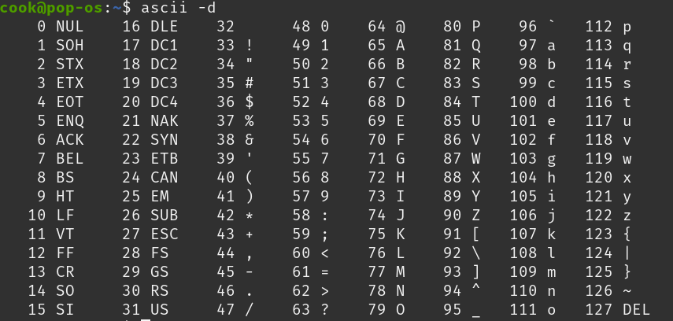

# [3. Longest Substring Without Repeating Characters](https://leetcode.com/problems/longest-substring-without-repeating-characters/description/)

- Basic Fixed Size Sliding Window. Make sure to erase from the map or freq array

- When using freq array make sure to use size > 93 array

### C++ Solution

```cpp
class Solution {
public:
    int lengthOfLongestSubstring(string s) {
        unordered_map<int,int> mp;
        int i = 0;
        int n = s.size();
        int ans = 0;
        for(int j = 0; j < n; j++){
            mp[s[j]]++;
            while(i < j && mp.size() < j-i+1){
                if(--mp[s[i]] == 0){
                    mp.erase(s[i]);
                }
                i++;
            }
            ans = max(ans, j-i+1);
            
        }
        return ans;
    }
};
```
### Java Solution

```java
class Solution {
    public int lengthOfLongestSubstring(String s) {
        int[] freq = new int[100];
        int n = s.length();

        int i=0;
        int ct=0;
        int ans=0;
        for(int j=0;j<n;j++){
            if(++freq[s.charAt(j)-' '] == 1) ct++;

            while(ct < j-i+1){
                if(--freq[s.charAt(i)-' '] == 0) ct--;
                i++;
            }

            ans = Math.max(ans, ct);
        }
        return ans;
    }
}
```
---

## Ascii — Quick Notes

